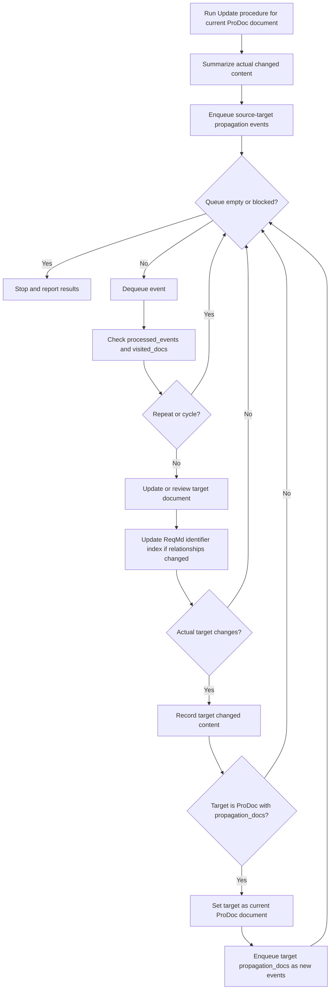

# 프로그래머블 문서 작성 시스템 (ProDoc)

Programmable Documentation System `ProDoc`은 Markdown 문서의 frontmatter를 선언적 설정으로 활용하여, 에이전트형 인공지능이 문서를 작성하고 검증하며, 문서 간 추적성과 변경 사항 전파를 수행하도록 하는 시스템입니다.
즉, 문서에 포함된 메타데이터가 에이전트의 작성 방식과 동작 기준을 결정하고, 에이전트는 이를 바탕으로 문서의 목적과 형식에 맞게 내용을 생성하고 관리합니다.

ProDoc은 ReqMd 위에서 동작하는 시스템입니다. ProDoc으로 작성되는 문서, 그 문서가 준수해야하는 요구사항과 그리고 변경 사항을 전파할 대상 문서는 ReqMd 형식으로 작성된 문서입니다. 다만 ProDoc 으로 작성되는 문서의 관련 도메인 지식은 ReqMd 를 따를 필요는 없습니다.

> programmable = agent behavior is configurable by document metadata

문서의 frontmatter에는 다음 내용을 기술합니다.

- 문서의 요구사항: 에이전트가 준수해야 할 문서의 유형과 특징을 설정합니다.
- 참조할 도메인 지식: 에이전트가 문서를 작성할 때 참고해야 할 지식을 설정합니다.
- 영향을 주는 문서: 현재 문서가 어떤 문서에 영향을 주는지 설정합니다.

frontmatter의 경로는 ProDoc 문서가 위치한 디렉터리를 기준으로 해석합니다.
참조한 파일이나 요구사항 ID가 존재하지 않으면 임의로 대체하지 않고 검토 필요 항목으로 보고합니다.
빈 목록은 “선언되었지만 대상 없음”으로 처리하며, 누락된 선택 항목은 해당 단계가 없는 것으로 처리합니다.

ProDoc frontmatter 예제:

```yaml
---
reqmd_prodoc:
  requirement_refs:
    - reqmd/example-aspice:       # Path to ReqMd identifier index
      - SWE_3_BP_1                # Identifier of index
      - WP_04_05
    - path/to/reqmd-index:
      - REQ_ID_1
      - REQ_ID_2                  
  knowledge_files:
    - knowledge1.md
    - knowledge2.md
  propagation_docs:
    lateral:
      - path/to/reqmd_lateral1.md
      - path/to/reqmd_lateral2.md
    upstream:
      - path/to/reqmd_upstream.md
    downstream:
      - path/to/reqmd_downstream.md
---
```

## Frontmatter의 구성

### Requirements

Requirements 영역의 목적은 ProDoc 문서가 어떤 기준을 만족해야 하는지 명확히 선언하는 것입니다.
문서 작성자는 이 영역을 통해 현재 문서가 따라야 할 ReqMd 요구사항을 지정하고, 에이전트는 이를 문서 작성과 검증의 기준으로 사용합니다.

Requirements는 문서가 갖추어야 할 요구사항을 설명합니다.
이는 문서가 기술하는 대상 자체의 요구사항과는 다른 개념입니다.
예를 들어 어떤 ProDoc 문서가 특정 프로젝트의 SW 상세 설계를 설명한다면, Requirements 영역은 그 프로젝트의 소프트웨어 요구사항을 직접 나열하는 곳이 아닙니다.
이 영역은 SW 상세 설계서라는 문서가 어떤 구조, 내용, 품질, 추적성 기준을 갖추어야 하는지를 정의합니다.

requirement_refs:

`requirement_refs`는 ProDoc 문서가 준수해야 하는 ReqMd 요구사항 식별자 목록입니다.
에이전트는 이 항목을 통해 문서 작성 전에 관련 요구사항을 조회하고, 문서가 해당 요구사항의 의도와 제약을 만족하는지 검증합니다.
ProDoc 문서 작성 및 검증 작업에서 `requirement_refs`는 필수 항목입니다.

각 항목은 ReqMd identifier index 경로를 키로 사용하고, 그 아래에 참조할 요구사항 ID를 나열합니다.
경로는 요구사항 ID가 정의된 `@.md` index를 찾을 수 있는 위치를 가리켜야 합니다.

예를 들어 문서가 `SWE_3_BP_1`과 `WP_04_05`를 따라야 한다면, 에이전트는 해당 ID의 원문 섹션을 읽고 다음 기준으로 문서를 작성합니다.

- 문서가 요구사항에서 기대하는 산출물 유형과 목적을 충족하는지 확인합니다.
- 요구사항의 필수 특성, 제약, 추적성 조건을 문서 구조와 내용에 반영합니다.
- 작성 후에는 요구사항별 충족 여부를 점검하고 누락되거나 불명확한 부분을 보고합니다.

### Knowledge

Knowledge 영역의 목적은 요구사항의 형식과 특성 만으로는 알 수 없는 도메인 지식과 작성 문맥을 에이전트에게 제공하는 것입니다.
요구사항은 문서가 만족해야 할 기준을 정의하지만, 실제 문서의 내용은 제품, 시스템, 조직, 프로세스, 설계 배경과 같은 구체적인 지식이 있어야 작성될 수 있습니다.

이 영역에 선언된 파일은 에이전트가 문서 본문을 구성할 때 참고하는 지식 기반입니다.
에이전트는 지식 파일을 통해 용어의 의미, 기존 의사결정, 제품 특성, 작성 규칙을 파악하고, 이를 요구사항 충족을 위한 구체적인 설명으로 변환합니다.
Knowledge 설정은 ProDoc 문서가 단순한 템플릿 채우기가 아니라, 주어진 도메인 문맥에 맞는 문서로 작성되도록 돕습니다.

knowledge_files:

`knowledge_files`는 문서 작성에 필요한 도메인 지식 파일 목록입니다.
이 파일들은 ReqMd 형식일 필요는 없으며, 제품 설명, 설계 배경, 용어 정의, 운영 정책, 기존 문서 작성 규칙처럼 문서 내용을 구체화하기 위한 참고 자료로 사용됩니다.
`knowledge_files`는 선택 항목이며, 문서 작성에 별도 도메인 지식이 필요할 때 선언합니다.

에이전트는 `knowledge_files`를 요구사항과 구분해서 사용합니다.
요구사항은 문서가 반드시 만족해야 하는 기준이고, 지식 파일은 그 기준을 만족하는 내용을 작성하기 위한 근거와 문맥입니다.

에이전트는 문서 작성 시 다음 순서로 지식 파일을 활용합니다.

- 문서 목적과 관련된 용어, 배경, 사실 정보를 추출합니다.
- 요구사항을 만족하기 위해 필요한 구체적 설명, 예시, 제한 조건을 보강합니다.
- 지식 파일 간 내용이 충돌할 경우 임의로 병합하지 않고 검토가 필요한 항목으로 표시합니다.

### Propagation

Propagation 영역의 목적은 현재 문서의 변경이 다른 문서에 어떤 영향을 줄 수 있는지 선언하는 것입니다.
ProDoc 문서는 독립적으로 존재하지 않고 요구사항, 설계, 구현, 검증 문서와 연결되므로, 한 문서의 변경은 같은 수준의 문서, 상위 문서, 하위 문서에 영향을 줄 수 있습니다.

이 영역은 에이전트가 변경 영향 분석을 수행할 때 사용하는 전파 지도입니다.
에이전트는 현재 문서의 변경 내용을 기준으로 전파 대상 문서를 검토하고, 일관성 유지, 상위 의도와의 정합성 확인, 하위 산출물 갱신 여부를 판단합니다.
전파 대상 문서가 다시 ProDoc 문서이고 자체 `propagation_docs`를 가지고 있다면, 전파는 그 문서에서 멈추지 않고 다음 단계의 대상 문서로 이어질 수 있습니다.

propagation_docs:

`propagation_docs`는 현재 ProDoc 문서의 변경이 영향을 줄 수 있는 다른 ReqMd 또는 ProDoc 문서를 선언하는 영역입니다.
에이전트는 이 설정을 사용하여 현재 문서가 수정된 뒤 어떤 문서를 함께 검토하거나 갱신해야 하는지 판단합니다.
`propagation_docs`는 선택 항목이며, 선언되지 않으면 변경 전파 단계는 수행하지 않습니다.

전파 대상은 영향의 방향에 따라 `lateral`, `upstream`, `downstream`으로 구분합니다.
이 구분은 에이전트가 변경 사항의 의미를 해석하고, 필요한 검토 범위를 정하는 기준이 됩니다.

전파는 source-target change event를 담은 Queue로 처리합니다.
각 Queue 항목은 최소한 `source_doc`, `target_doc`, `direction`, `changed_content`, `reason/trace`를 포함합니다.
`changed_content`는 사용자의 최초 요청 문장이 아니라, 해당 단계에서 source 문서에 실제로 반영된 변경 내용을 요약한 것입니다.
에이전트는 Queue에서 항목을 하나씩 꺼내 target 문서를 검토하거나 업데이트하고, target 문서에서 실제 변경이 발생한 경우 그 변경을 다시 요약합니다.

전파 대상 문서가 ProDoc frontmatter를 가지고 있고 그 안에 `propagation_docs`가 선언되어 있으면, 에이전트는 먼저 해당 대상 문서를 incoming `changed_content`에 맞게 업데이트합니다.
그 다음 업데이트된 대상 문서를 새로운 current ProDoc document로 간주하고, 그 문서에서 실제로 발생한 changed content를 기준으로 해당 문서의 전파 설정을 Queue에 추가합니다.
이 경우 전파는 단일 단계의 문서 갱신으로 끝나지 않고, 여러 ProDoc 문서가 연결된 사슬 형태로 확장됩니다.
에이전트는 normalized path 기반 `visited_docs`로 순환 전파를 방지하고, `processed_events` 또는 동등한 source-target-change fingerprint로 동일한 전파 이벤트의 반복 처리를 방지합니다.
문서 방문 여부와 전파 이벤트 처리 여부는 구분합니다.
이미 방문한 문서라도 다른 source에서 온 변경은 검토 또는 보고 대상이 될 수 있으며, 최종 보고에는 처리된 source-target 관계와 중단 사유를 포함합니다.

lateral:

`lateral`은 현재 문서와 같은 수준에서 서로 일관성을 유지해야 하는 문서 목록입니다.
예를 들어 같은 요구사항을 다른 관점에서 설명하는 설계 문서, 동일 산출물의 보조 문서, 병렬 컴포넌트 문서가 여기에 해당합니다.
`lateral` 전파는 추상화 수준을 바꾸지 않습니다.
즉, 현재 문서와 대상 문서는 비슷한 상세도와 책임 범위를 가지며, 변경의 목적은 내용을 더 추상화하거나 구체화하는 것이 아니라 같은 수준의 문서들이 서로 모순되지 않도록 맞추는 것입니다.

현재 문서가 변경되면 에이전트는 `lateral` 문서에서 다음 사항을 확인합니다.

- 용어, 인터페이스, 제약 조건이 서로 모순되지 않는지 확인합니다.
- 동일한 요구사항을 다루는 설명이 서로 다른 결론을 내리지 않는지 확인합니다.
- 필요한 경우 관련 문서의 설명, 링크, 추적성 정보를 함께 갱신합니다.
- 한 문서의 변경이 같은 수준의 다른 문서에서 대응되는 설명이나 결정 변경을 요구하는지 확인합니다.
- 같은 수준의 문서 관계가 새로 생기거나 변경되면, 해당 요구사항 간 lateral 관계를 ReqMd 식별자 색인에 반영합니다.

upstream:

`upstream`은 현재 문서보다 상위 수준의 의도, 요구사항, 정책, 아키텍처를 담은 문서 목록입니다.
현재 문서의 변경이 상위 문서의 요구사항을 위반하거나 상위 문서의 갱신 필요성을 드러낼 수 있을 때 사용합니다.
`upstream` 전파는 구체적인 변경에서 더 추상적인 기준으로 거슬러 올라가는 방향입니다.
따라서 현재 문서의 상세 변경을 그대로 상위 문서에 복사하는 것이 아니라, 그 변경이 상위 수준의 목적, 요구사항, 제약, 의사결정에 어떤 의미를 가지는지 추상화해서 검토합니다.

에이전트는 `upstream` 문서를 직접 변경하기 전에 다음을 우선 확인합니다.

- 현재 문서 변경이 상위 요구사항의 범위 안에 있는지 확인합니다.
- 상위 문서의 요구사항, 용어, 의사결정과 충돌하는 부분이 있는지 확인합니다.
- 상세 변경을 상위 수준의 요구사항, 정책, 설계 원칙 변경으로 일반화해야 하는지 확인합니다.
- 현재 요구사항이 상위 요구사항과 새로 연결되거나 연결이 바뀌면, upstream 관계를 ReqMd 식별자 색인에 반영합니다.
- 상위 문서 자체의 수정이 필요해 보이면 변경 제안 또는 검토 항목으로 보고합니다.

downstream:

`downstream`은 현재 문서를 근거로 더 구체적인 설계, 구현, 테스트, 운영 내용을 작성하는 하위 문서 목록입니다.
현재 문서가 변경되면 하위 문서의 상세 내용, 검증 기준, 테스트 케이스, 추적 링크가 영향을 받을 수 있습니다.
`downstream` 전파는 상위 또는 중간 수준의 변경을 더 구체적인 산출물로 내려보내는 방향입니다.
따라서 현재 문서의 요구사항, 설계 결정, 정책 변경을 하위 문서의 상세 설계, 구현 규칙, 테스트 조건, 운영 절차로 구체화합니다.

에이전트는 `downstream` 문서에서 다음 사항을 확인합니다.

- 현재 문서의 변경이 하위 문서의 설명이나 결론에 반영되어야 하는지 확인합니다.
- 변경된 요구사항 또는 설계 결정에 맞게 상세 항목을 갱신합니다.
- 하위 문서가 더 이상 현재 문서를 정확히 추적하지 못하면 링크와 참조를 수정합니다.
- 추상적인 변경을 하위 문서에서 실행 가능한 상세 항목, 검증 가능한 조건, 또는 구현 가능한 지침으로 변환합니다.
- 현재 요구사항에서 파생되는 하위 요구사항이나 산출물 관계가 바뀌면, downstream 관계를 ReqMd 식별자 색인에 반영합니다.

## Workflow

에이전트는 ProDoc 문서를 작성하거나 수정할 때 frontmatter를 실행 계획처럼 사용합니다.
문서 본문만 보고 작성하지 않고, frontmatter에 선언된 요구사항, 지식 파일, 전파 대상 문서를 함께 해석하여 작업 범위와 검증 기준을 정합니다.

### Update

Update 절차의 목적은 ProDoc 문서의 본문을 frontmatter에 선언된 기준과 문맥에 맞게 작성하거나 수정하는 것입니다.
이 절차는 전파보다 먼저 수행되며, 전파에 사용할 `changed_content`는 Update 절차에서 실제로 문서에 반영된 변경 내용을 요약한 결과입니다.

에이전트는 `requirement_refs`를 문서가 반드시 만족해야 하는 기준으로 사용합니다.
`requirement_refs`에 선언된 ReqMd 요구사항 원문을 조회하여 문서의 목적, 필수 구조, 포함해야 할 내용, 품질 기준, 추적성 조건을 확인합니다.
문서를 업데이트할 때는 기존 본문이 이 기준을 충족하는지 먼저 비교하고, 누락된 구조나 내용, 모순되는 설명, 불명확한 추적성을 수정 대상으로 식별합니다.
Update 결과는 다시 `requirement_refs` 기준으로 검증되어야 하며, 요구사항을 만족하지 못하거나 판단이 어려운 항목은 검토 필요 항목으로 보고합니다.

에이전트는 `knowledge_files`를 요구사항을 실제 문서 내용으로 구체화하기 위한 도메인 문맥으로 사용합니다.
지식 파일에서는 제품, 시스템, 조직, 프로세스, 설계 배경, 용어, 기존 의사결정, 작성 규칙을 추출합니다.
이 정보는 요구사항이 요구하는 문서 구조와 품질 기준을 채우기 위한 근거로 사용되지만, `requirement_refs`를 대체하거나 완화하지 않습니다.
지식 파일 간 내용이 충돌하거나 지식 파일의 내용이 요구사항과 충돌하면 임의로 병합하지 않습니다.
요구사항과 지식 파일이 충돌할 때는 요구사항을 우선하고, 충돌한 지식은 검토 필요 항목으로 남깁니다.

Update 절차는 다음 순서로 수행합니다.

1. `requirement_refs`의 ReqMd 식별자 색인과 요구사항 원문을 조회합니다.
2. 문서가 만족해야 할 구조, 필수 내용, 품질 기준, 추적성 조건을 정리합니다.
3. 필요한 `knowledge_files`를 읽고 요구사항을 구체화하는 데 필요한 도메인 문맥을 추출합니다.
4. 현재 본문을 요구사항 기준과 지식 문맥에 비교하여 유지할 내용, 수정할 내용, 추가할 내용을 식별합니다.
5. 요구사항을 만족하도록 본문을 업데이트하되, 지식 파일은 보조 근거와 구체화 자료로만 사용합니다.
6. 업데이트된 본문을 `requirement_refs` 기준으로 검증하고, 누락, 충돌, 불명확한 판단을 기록합니다.
7. 실제로 반영된 변경만 `changed_content`로 요약하여 이후 전파 절차의 입력으로 사용합니다.

### 식별자 색인과 전파 관계

Propagation은 문서 본문만 갱신하는 작업이 아닙니다.
전파 과정에서 `lateral`, `upstream`, `downstream` 관계가 확인되거나 변경되면, 그 관계는 ReqMd 식별자 색인에도 반영되어야 합니다.
식별자 색인은 문서간 요구사항의 추적성을 제공하므로, 전파된 변경이 실제 문서에는 반영되었지만 색인에는 남지 않는 상태를 피해야 합니다.
색인 갱신은 ProDoc 자체 규칙으로 처리하지 않습니다.
ReqMd 식별자 색인 `@.md`의 기존 규칙과 형식을 준수해야 합니다.
ProDoc은 ReqMd 식별자 색인 규칙을 새로 정의하거나, 기존 ReqMd 규칙을 변형하거나 확장하지 않습니다.

에이전트는 전파 대상 문서를 수정한 뒤 다음 사항을 확인합니다.

- lateral 전파로 같은 수준의 요구사항 또는 문서 섹션이 연결되었는지 확인하고, 필요한 색인 링크를 ReqMd 식별자 색인 형식에 맞게 갱신합니다.
- upstream 전파로 현재 요구사항이 더 상위 요구사항, 정책, 아키텍처 결정과 연결되었는지 확인하고, 상위 방향 추적성을 ReqMd 식별자 색인 형식에 맞게 갱신합니다.
- downstream 전파로 현재 요구사항에서 파생된 상세 설계, 구현, 테스트, 운영 요구사항이 바뀌었는지 확인하고, 하위 방향 추적성을 ReqMd 식별자 색인 형식에 맞게 갱신합니다.
- 색인에 추가하거나 제거해야 하는 관계가 불명확하면 임의로 삭제하지 않고 검토 필요 항목으로 남깁니다.

### 전파 절차

전파는 현재 문서에 대해 Update 절차를 먼저 수행한 뒤, 그 결과로 실제 발생한 변경을 Queue에 넣어 처리하는 절차입니다.
에이전트는 대상 Markdown 문서가 ProDoc인지 판별하고 `reqmd_prodoc` frontmatter를 파싱한 뒤, `requirement_refs`와 `knowledge_files`를 사용하여 현재 ProDoc 문서의 Update 절차를 수행합니다.
Update 절차에서 작성 또는 수정된 본문이 참조 요구사항을 충족하는지 검증한 뒤, 현재 문서에 실제로 반영된 변경 내용을 `changed_content`로 요약합니다.
그 후 현재 문서의 `propagation_docs`에 선언된 대상마다 source-target change event를 만들고 Queue에 추가합니다.

에이전트는 Queue에서 event를 하나씩 꺼내 `direction`에 따라 target 문서를 검토합니다.
target 문서에 필요한 조치는 즉시 수정, 검토 필요 항목 기록, 영향 없음 판정 중 하나가 될 수 있습니다.
target 문서 갱신으로 요구사항 간 관계가 바뀌면, 에이전트는 ReqMd 식별자 색인을 함께 갱신하고 검증하여 propagation 결과가 추적성 구조에 남도록 합니다.
target이 ProDoc이고 실제 변경이 발생했으며 자체 `propagation_docs`가 있다면, 에이전트는 target을 다음 current ProDoc document로 취급합니다.
이후 target 문서에서 실제로 발생한 변경 내용을 새로운 `changed_content`로 요약하고, target의 전파 대상들을 source-target change event로 Queue에 추가합니다.
이 반복은 Queue가 비거나, 순환 또는 차단 조건으로 더 이상 안전하게 진행할 수 없을 때 종료됩니다.
전파는 다음 조건에서도 중단합니다.

- 현재 단계에서 문서 내용이나 식별자 색인에 실제 변경이 발생하지 않은 경우
- 전파 대상 파일, ReqMd 식별자 색인, 요구사항 ID가 존재하지 않는 경우
- 상위 문서 수정처럼 자동 변경이 위험하여 사용자 판단이 필요한 경우
- normalized path 기준으로 이미 방문한 ProDoc 문서가 다시 current가 되어 순환 전파가 발생하는 경우
- 동일한 source-target-change fingerprint가 이미 `processed_events`에 기록되어 반복 처리가 되는 경우

중단 사유는 최종 보고에 포함해야 합니다.



### 기본 Workflow

기본 workflow는 다음과 같습니다.

1. 대상 Markdown 문서가 ProDoc인지 판별하고 `reqmd_prodoc` frontmatter를 파싱합니다.
2. `requirement_refs`에 선언된 ReqMd 요구사항 원문을 조회하여 문서가 만족해야 할 구조, 내용, 품질, 추적성 기준을 정리합니다.
3. `knowledge_files`를 읽어 요구사항을 구체화하는 데 필요한 도메인 지식, 용어, 제약 조건을 수집합니다.
4. Update 절차를 수행하여 요구사항 기준과 지식 문맥에 맞게 현재 문서를 작성하거나 수정합니다.
5. 업데이트된 문서가 참조 요구사항을 충족하는지 검증하고, 누락 또는 충돌 항목을 식별합니다.
6. Update 절차에서 현재 문서에 실제로 반영된 변경 사항을 `changed_content`로 요약합니다.
7. `propagation_docs`의 `lateral`, `upstream`, `downstream` 대상마다 `source_doc`, `target_doc`, `direction`, `changed_content`, `reason/trace`를 가진 Queue event를 생성합니다.
8. Queue에서 event를 하나씩 꺼내 target 문서에 필요한 변경을 반영하거나, 자동 수정하기 어려운 항목은 검토 필요 사항으로 남깁니다.
9. 전파 과정에서 lateral, upstream, downstream 요구사항 관계가 새로 식별되거나 변경되면 ReqMd 식별자 색인을 갱신하고 검증합니다.
10. target 문서가 ProDoc이고 실제 변경이 발생했으며 자체 `propagation_docs`를 가지고 있으면, target 문서를 새로운 current ProDoc document로 설정하고 target의 실제 변경 내용을 다음 `changed_content`로 요약합니다.
11. target 문서의 전파 대상들을 새 Queue event로 추가하고, Queue가 비거나 순환, 반복 event, 깨진 참조, 사용자 판단 필요 조건에 도달할 때까지 반복합니다.
12. 전파를 종료하면 전체 변경, 처리된 source-target 관계, 식별자 색인 갱신 내역, 중단 사유, 검토 항목을 요약합니다.

이 workflow의 핵심은 문서의 메타데이터가 에이전트의 행동을 제한하고 안내한다는 점입니다.
따라서 ProDoc 문서의 frontmatter는 단순한 설명 정보가 아니라, 문서 작성과 검증, 변경 전파를 제어하는 선언적 프로그램으로 취급됩니다.

## Skill 전환시 고려 항목

ProDoc을 agentic skill로 만들 때는 고려되어야 할 항목에 대해 설명합니다.

### Skill trigger

ProDoc skill은 사용자가 ProDoc 문서를 작성, 수정, 검증, 전파하거나 ReqMd skill을 사용해 ReqMd 식별자 색인을 함께 갱신하도록 요청할 때 사용합니다.
특히 다음 요청은 ProDoc skill의 적용 대상입니다.

- `reqmd_prodoc` frontmatter를 가진 Markdown 문서를 작성하거나 수정하는 요청
- ProDoc 문서가 참조하는 ReqMd 요구사항을 기준으로 문서 충족 여부를 검증하는 요청
- `propagation_docs`에 선언된 문서로 변경 사항을 전파하는 요청
- 전파 과정에서 확인된 `lateral`, `upstream`, `downstream` 관계를 ReqMd skill을 사용해 ReqMd 식별자 색인에 반영하는 요청

### ProDoc 판별 규칙

Markdown 문서의 YAML frontmatter에 `reqmd_prodoc:` 키가 있으면 해당 문서를 ProDoc 문서로 판별합니다.
`reqmd_prodoc:` 키가 없으면 일반 Markdown 또는 ReqMd 문서로 보고, 사용자가 명시적으로 ProDoc으로 다루라고 요청하지 않는 한 ProDoc workflow를 적용하지 않습니다.
frontmatter가 없거나 YAML 파싱이 실패하면 문서를 수정하기 전에 문제를 보고하고, 필요한 경우 사용자가 의도한 ProDoc 설정을 확인합니다.

### 결과 검증 체크리스트

ProDoc 작업이 끝나면 에이전트는 결과를 보고하기 전에 다음 항목을 확인합니다.

- ProDoc 문서의 YAML frontmatter가 유효하고 `reqmd_prodoc` 구조를 가진다.
- `requirement_refs`에 선언된 ReqMd 식별자 색인과 요구사항 ID가 존재한다.
- 작성 또는 수정된 본문이 참조 요구사항이 요구하는 문서 구조, 내용, 품질, 추적성 기준을 충족한다.
- `knowledge_files`에 선언된 파일이 존재하며, 문서 내용과 충돌하는 지식이 있으면 검토 필요 항목으로 남긴다.
- `propagation_docs`에 선언된 전파 대상 문서가 존재하고, 방향별 영향 분석 결과가 기록되어 있다.
- 전파 과정에서 변경된 `lateral`, `upstream`, `downstream` 관계의 ReqMd 식별자 색인이 ReqMd skill을 사용해 갱신 및 검증되어 있다.
- 다단계 propagation에서 방문한 ProDoc 문서가 추적되어 순환 전파가 발생하지 않는다.
- 자동 수정하지 않은 항목, 깨진 참조, 누락된 요구사항, 사용자 판단이 필요한 항목이 최종 보고에 포함되어 있다.

### 산출물 보고 형식

ProDoc 작업 결과는 다음 항목을 포함하여 보고합니다.

- 수정한 ProDoc 문서와 주요 변경 요약
- 참조한 ReqMd 요구사항 ID와 충족 여부
- 전파 대상 문서별 조치 결과
- 갱신한 ReqMd 식별자 색인과 변경된 관계
- 자동으로 판단하지 않은 검토 필요 항목
