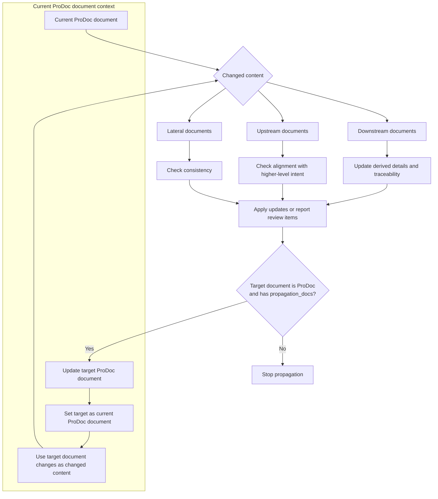

# 프로그래머블 문서 작성 시스템 (ProDoc)

Programmable Documentation System `ProDoc`은 Markdown 문서의 frontmatter를 선언적 설정으로 활용하여, 에이전트형 인공지능이 문서를 작성하고 검증하며, 문서 간 추적성과 변경 사항 전파를 수행하도록 하는 시스템입니다.
즉, 문서에 포함된 메타데이터가 에이전트의 작성 방식과 동작 기준을 결정하고, 에이전트는 이를 바탕으로 문서의 목적과 형식에 맞게 내용을 생성하고 관리합니다.

ProDoc은 ReqMd 위에서 동작하는 시스템입니다. ProDoc으로 작성되는 문서, 그 문서가 준수해야하는 요구사항과 그리고 변경 사항을 전파할 대상 문서는 ReqMd 형식으로 작성된 문서입니다. 다만 ProDoc 으로 작성되는 문서의 관련 도메인 지식은 ReqMd 를 따를 필요는 없습니다.

> programmable = agent behavior is configurable by document metadata

문서의 frontmatter에는 다음 내용을 기술합니다.

- 문서의 요구사항: 에이전트가 준수해야 할 문서의 유형과 특징을 설정합니다.
- 참조할 도메인 지식: 에이전트가 문서를 작성할 때 참고해야 할 지식을 설정합니다.
- 영향을 주는 문서: 현재 문서가 어떤 문서에 영향을 주는지 설정합니다.

ProDoc frontmatter 예제:

```yaml
---
reqmd_prodoc:
  requirement_refs:
    - reqmd/example-aspice:       # Path to ReqMd identifier index
      - SWE_3_BP_1                # Identifier of index
      - WP_04_05
    - path/to/reqmd-index:
      - REQ_ID_1
      - REQ_ID_2                  
  knowledge_files:
    - knowledge1.md
    - knowledge2.md
  propagation_docs:
    lateral:
      - path/to/reqmd_lateral1.md
      - path/to/reqmd_lateral2.md
    upstream:
      - path/to/reqmd_upstream.md
    downstream:
      - path/to/reqmd_downstream.md
---
```

## Frontmatter의 구성

### Requirements

Requirements 영역의 목적은 ProDoc 문서가 어떤 기준을 만족해야 하는지 명확히 선언하는 것입니다.
문서 작성자는 이 영역을 통해 현재 문서가 따라야 할 ReqMd 요구사항을 지정하고, 에이전트는 이를 문서 작성과 검증의 기준으로 사용합니다.

이 영역은 문서의 자유로운 설명을 제한하기 위한 장치가 아니라, 문서가 요구사항과 분리되어 임의로 작성되는 것을 방지하기 위한 추적성 장치입니다.
따라서 Requirements 설정은 현재 문서가 어떤 요구사항을 근거로 작성되었는지, 작성된 결과가 어떤 요구사항을 만족해야 하는지, 변경 시 어떤 요구사항을 다시 검토해야 하는지를 결정합니다.

requirement_refs:

`requirement_refs`는 ProDoc 문서가 준수해야 하는 ReqMd 요구사항 식별자 목록입니다.
에이전트는 이 항목을 통해 문서 작성 전에 관련 요구사항을 조회하고, 문서가 해당 요구사항의 의도와 제약을 만족하는지 검증합니다.

각 항목은 ReqMd 루트 또는 identifier index 경로를 키로 사용하고, 그 아래에 참조할 요구사항 ID를 나열합니다.
경로는 요구사항 ID가 정의된 `@.md` index를 찾을 수 있는 위치를 가리켜야 합니다.

예를 들어 문서가 `SWE_3_BP_1`과 `WP_04_05`를 따라야 한다면, 에이전트는 해당 ID의 원문 섹션을 읽고 다음 기준으로 문서를 작성합니다.

- 문서가 요구사항에서 기대하는 산출물 유형과 목적을 충족하는지 확인합니다.
- 요구사항의 필수 특성, 제약, 추적성 조건을 문서 구조와 내용에 반영합니다.
- 작성 후에는 요구사항별 충족 여부를 점검하고 누락되거나 불명확한 부분을 보고합니다.

### Knowledge

Knowledge 영역의 목적은 요구사항만으로는 알 수 없는 도메인 지식과 작성 문맥을 에이전트에게 제공하는 것입니다.
요구사항은 문서가 만족해야 할 기준을 정의하지만, 실제 문서의 내용은 제품, 시스템, 조직, 프로세스, 설계 배경과 같은 구체적인 지식이 있어야 작성될 수 있습니다.

이 영역에 선언된 파일은 에이전트가 문서 본문을 구성할 때 참고하는 지식 기반입니다.
에이전트는 지식 파일을 통해 용어의 의미, 기존 의사결정, 제품 특성, 작성 규칙을 파악하고, 이를 요구사항 충족을 위한 구체적인 설명으로 변환합니다.
Knowledge 설정은 ProDoc 문서가 단순한 템플릿 채우기가 아니라, 주어진 도메인 문맥에 맞는 문서로 작성되도록 돕습니다.

knowledge_files:

`knowledge_files`는 문서 작성에 필요한 도메인 지식 파일 목록입니다.
이 파일들은 ReqMd 형식일 필요는 없으며, 제품 설명, 설계 배경, 용어 정의, 운영 정책, 기존 문서 작성 규칙처럼 문서 내용을 구체화하기 위한 참고 자료로 사용됩니다.

에이전트는 `knowledge_files`를 요구사항과 구분해서 사용합니다.
요구사항은 문서가 반드시 만족해야 하는 기준이고, 지식 파일은 그 기준을 만족하는 내용을 작성하기 위한 근거와 문맥입니다.

에이전트는 문서 작성 시 다음 순서로 지식 파일을 활용합니다.

- 문서 목적과 관련된 용어, 배경, 사실 정보를 추출합니다.
- 요구사항을 만족하기 위해 필요한 구체적 설명, 예시, 제한 조건을 보강합니다.
- 지식 파일 간 내용이 충돌할 경우 임의로 병합하지 않고 검토가 필요한 항목으로 표시합니다.

### Propagation

Propagation 영역의 목적은 현재 문서의 변경이 다른 문서에 어떤 영향을 줄 수 있는지 선언하는 것입니다.
ProDoc 문서는 독립적으로 존재하지 않고 요구사항, 설계, 구현, 검증 문서와 연결되므로, 한 문서의 변경은 같은 수준의 문서, 상위 문서, 하위 문서에 영향을 줄 수 있습니다.

이 영역은 에이전트가 변경 영향 분석을 수행할 때 사용하는 전파 지도입니다.
에이전트는 현재 문서의 변경 내용을 기준으로 전파 대상 문서를 검토하고, 일관성 유지, 상위 의도와의 정합성 확인, 하위 산출물 갱신 여부를 판단합니다.
전파 대상 문서가 다시 ProDoc 문서이고 자체 `propagation_docs`를 가지고 있다면, 전파는 그 문서에서 멈추지 않고 다음 단계의 대상 문서로 이어질 수 있습니다.

propagation_docs:

`propagation_docs`는 현재 ProDoc 문서의 변경이 영향을 줄 수 있는 다른 ReqMd 문서를 선언하는 영역입니다.
에이전트는 이 설정을 사용하여 현재 문서가 수정된 뒤 어떤 문서를 함께 검토하거나 갱신해야 하는지 판단합니다.

전파 대상은 영향의 방향에 따라 `lateral`, `upstream`, `downstream`으로 구분합니다.
이 구분은 에이전트가 변경 사항의 의미를 해석하고, 필요한 검토 범위를 정하는 기준이 됩니다.

전파 대상 문서가 ProDoc frontmatter를 가지고 있고 그 안에 `propagation_docs`가 선언되어 있으면, 에이전트는 먼저 해당 대상 문서를 현재 변경 내용에 맞게 업데이트합니다.
그 다음 업데이트된 대상 문서를 새로운 current ProDoc document로 간주하고, 그 문서에서 발생한 changed content를 기준으로 해당 문서의 전파 설정을 이어서 해석합니다.
이 경우 전파는 단일 단계의 문서 갱신으로 끝나지 않고, 여러 ProDoc 문서가 연결된 사슬 형태로 확장됩니다.
에이전트는 이미 방문한 문서를 추적하여 순환 전파를 방지하고, 각 단계에서 실제 변경 영향이 있는 문서만 다음 단계로 전파합니다.

lateral:

`lateral`은 현재 문서와 같은 수준에서 서로 일관성을 유지해야 하는 문서 목록입니다.
예를 들어 같은 요구사항을 다른 관점에서 설명하는 설계 문서, 동일 산출물의 보조 문서, 병렬 컴포넌트 문서가 여기에 해당합니다.
`lateral` 전파는 추상화 수준을 바꾸지 않습니다.
즉, 현재 문서와 대상 문서는 비슷한 상세도와 책임 범위를 가지며, 변경의 목적은 내용을 더 추상화하거나 구체화하는 것이 아니라 같은 수준의 문서들이 서로 모순되지 않도록 맞추는 것입니다.

현재 문서가 변경되면 에이전트는 `lateral` 문서에서 다음 사항을 확인합니다.

- 용어, 인터페이스, 제약 조건이 서로 모순되지 않는지 확인합니다.
- 동일한 요구사항을 다루는 설명이 서로 다른 결론을 내리지 않는지 확인합니다.
- 필요한 경우 관련 문서의 설명, 링크, 추적성 정보를 함께 갱신합니다.
- 한 문서의 변경이 같은 수준의 다른 문서에서 대응되는 설명이나 결정 변경을 요구하는지 확인합니다.

upstream:

`upstream`은 현재 문서보다 상위 수준의 의도, 요구사항, 정책, 아키텍처를 담은 문서 목록입니다.
현재 문서의 변경이 상위 문서의 요구사항을 위반하거나 상위 문서의 갱신 필요성을 드러낼 수 있을 때 사용합니다.
`upstream` 전파는 구체적인 변경에서 더 추상적인 기준으로 거슬러 올라가는 방향입니다.
따라서 현재 문서의 상세 변경을 그대로 상위 문서에 복사하는 것이 아니라, 그 변경이 상위 수준의 목적, 요구사항, 제약, 의사결정에 어떤 의미를 가지는지 추상화해서 검토합니다.

에이전트는 `upstream` 문서를 직접 변경하기 전에 다음을 우선 확인합니다.

- 현재 문서 변경이 상위 요구사항의 범위 안에 있는지 확인합니다.
- 상위 문서의 요구사항, 용어, 의사결정과 충돌하는 부분이 있는지 확인합니다.
- 상세 변경을 상위 수준의 요구사항, 정책, 설계 원칙 변경으로 일반화해야 하는지 확인합니다.
- 상위 문서 자체의 수정이 필요해 보이면 변경 제안 또는 검토 항목으로 보고합니다.

downstream:

`downstream`은 현재 문서를 근거로 더 구체적인 설계, 구현, 테스트, 운영 내용을 작성하는 하위 문서 목록입니다.
현재 문서가 변경되면 하위 문서의 상세 내용, 검증 기준, 테스트 케이스, 추적 링크가 영향을 받을 수 있습니다.
`downstream` 전파는 상위 또는 중간 수준의 변경을 더 구체적인 산출물로 내려보내는 방향입니다.
따라서 현재 문서의 요구사항, 설계 결정, 정책 변경을 하위 문서의 상세 설계, 구현 규칙, 테스트 조건, 운영 절차로 구체화합니다.

에이전트는 `downstream` 문서에서 다음 사항을 확인합니다.

- 현재 문서의 변경이 하위 문서의 설명이나 결론에 반영되어야 하는지 확인합니다.
- 변경된 요구사항 또는 설계 결정에 맞게 상세 항목을 갱신합니다.
- 하위 문서가 더 이상 현재 문서를 정확히 추적하지 못하면 링크와 참조를 수정합니다.
- 추상적인 변경을 하위 문서에서 실행 가능한 상세 항목, 검증 가능한 조건, 또는 구현 가능한 지침으로 변환합니다.

전파는 현재 문서를 기준으로 영향 방향을 해석하는 절차입니다.
에이전트는 먼저 현재 문서의 변경 내용을 요약하고, `propagation_docs`에 선언된 문서들을 방향별로 읽은 뒤, 각 문서에 필요한 조치를 결정합니다.
조치는 즉시 수정, 검토 필요 항목 기록, 영향 없음 판정 중 하나가 될 수 있습니다.
전파 대상 문서가 ProDoc으로 설정되어 있고 자체 전파 대상이 있다면, 에이전트는 먼저 그 대상 문서를 업데이트합니다.
이후 업데이트된 대상 문서를 다음 current ProDoc document로 취급하고, 그 문서의 변경 내용을 새로운 changed content로 삼아 동일한 절차를 반복합니다.
이 반복은 더 이상 영향 받는 문서가 없거나, 순환 방지를 위해 이미 처리한 문서에 도달했을 때 종료됩니다.



## Workflow

에이전트는 ProDoc 문서를 작성하거나 수정할 때 frontmatter를 실행 계획처럼 사용합니다.
문서 본문만 보고 작성하지 않고, frontmatter에 선언된 요구사항, 지식 파일, 전파 대상 문서를 함께 해석하여 작업 범위와 검증 기준을 정합니다.

기본 workflow는 다음과 같습니다.

1. ProDoc frontmatter를 읽고 `requirement_refs`, `knowledge_files`, `propagation_docs`를 파악합니다.
2. `requirement_refs`에 선언된 ReqMd 요구사항 원문을 조회하여 문서가 만족해야 할 기준을 정리합니다.
3. `knowledge_files`를 읽어 문서 작성에 필요한 도메인 지식, 용어, 제약 조건을 수집합니다.
4. 요구사항과 지식 파일을 근거로 현재 문서를 작성하거나 수정합니다.
5. 작성된 문서가 참조 요구사항을 충족하는지 검증하고, 누락 또는 충돌 항목을 식별합니다.
6. 현재 문서의 변경 사항을 요약한 뒤 `propagation_docs`의 `lateral`, `upstream`, `downstream` 문서에 미치는 영향을 분석합니다.
7. 전파 대상 문서에 필요한 변경을 반영하거나, 자동 수정하기 어려운 항목은 검토 필요 사항으로 남깁니다.
8. 전파 대상 문서가 ProDoc이고 자체 `propagation_docs`를 가지고 있으면, 업데이트된 대상 문서를 새로운 current ProDoc document로 설정합니다.
9. 새 current ProDoc document에서 실제로 발생한 변경 내용을 changed content로 요약하고, 해당 문서의 frontmatter를 읽어 다음 단계 전파를 반복합니다.
10. 이미 처리한 문서에 다시 도달하거나 더 이상 영향 받는 문서가 없으면 전파를 종료하고 전체 변경 및 검토 항목을 요약합니다.

이 workflow의 핵심은 문서의 메타데이터가 에이전트의 행동을 제한하고 안내한다는 점입니다.
따라서 ProDoc 문서의 frontmatter는 단순한 설명 정보가 아니라, 문서 작성과 검증, 변경 전파를 제어하는 선언적 프로그램으로 취급됩니다.
