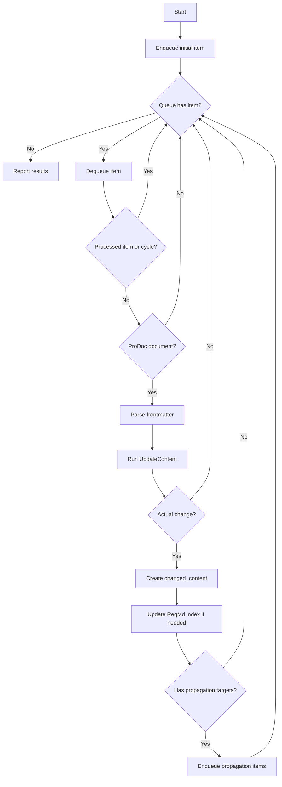

# 프로그래머블 문서 작성 시스템 (ProDoc)

Programmable Documentation System `ProDoc`은 Markdown 문서의 frontmatter를 선언적 설정으로 사용하여, 에이전트형 인공지능이 문서를 작성, 검증, 전파하도록 만드는 문서 작성 체계입니다.
frontmatter는 문서가 만족해야 할 산출물 기준, 참고할 지식, 변경 전파 대상을 선언합니다.

ProDoc은 ReqMd 위에서 동작합니다.
ProDoc에서 `requirement_specs`가 가리키는 요구사항은 문서 자체가 산출물로서 준수해야 하는 구조, 품질, 추적성 기준입니다.
반면 ProDoc 본문에 있는 ReqMd RequirementSection은 문서가 설명하는 제품, 시스템, 설계, 구현, 검증, 운영 요구사항입니다.
전자는 문서 작성과 검증의 기준이고, 후자는 전파와 추적의 대상입니다.

## Frontmatter의 구성

ProDoc 문서의 YAML frontmatter에는 `reqmd_prodoc` 키를 선언합니다.
그 아래에는 `requirement_specs`, `knowledge_files`, `propagation_docs`를 기술합니다.

ProDoc frontmatter 예제:

```yaml
---
reqmd_prodoc:
  requirement_specs:
    - reqmd/example-aspice:       # ReqMd 식별자 색인 경로
      - SWE_3_BP_1                # 적용할 문서 산출물 요구사항 ID
      - WP_04_05
    - path/to/reqmd-index:
      - REQ_ID_1
      - REQ_ID_2
  knowledge_files:
    - knowledge1.md
    - knowledge2.md
  propagation_docs:
    lateral:
      - path/to/reqmd_lateral1.md
      - path/to/reqmd_lateral2.md
    upstream:
      - path/to/reqmd_upstream.md
    downstream:
      - path/to/reqmd_downstream.md
---
```

frontmatter에 적힌 상대 경로는 ProDoc 문서가 위치한 디렉터리를 기준으로 해석합니다.

### requirement_specs

`requirement_specs`는 ProDoc 문서가 산출물로서 준수해야 하는 요구사항 명세 목록입니다. 문서 본문이 설명하는 제품, 시스템, 설계, 구현, 검증, 운영 요구사항 목록과 혼용해서는 안 됩니다.
예를 들어 ProDoc 문서가 SW 상세 설계를 설명한다면, `requirement_specs`는 소프트웨어 기능 요구사항 목록이 아니라 SW 상세 설계서가 갖추어야 할 구조, 필수 내용, 품질, 추적성 기준을 가리킵니다.

각 항목은 문서 산출물 요구사항 명세가 작성된 ReqMd identifier index 경로를 키로 사용하고, 그 아래에 적용할 요구사항 ID를 나열합니다.
ProDoc 문서 작성 및 검증에서 `requirement_specs`는 필수 항목입니다.

### knowledge_files

`knowledge_files`는 문서 내용을 작성하는 데 필요한 도메인 지식 파일 목록입니다. 제품 설명, 설계 배경, 용어 정의, 운영 정책, 기존 작성 규칙처럼 요구사항만으로는 알 수 없는 문맥을 제공합니다.
`requirement_specs`가 문서의 준수 기준이라면, `knowledge_files`는 그 기준에 맞게 본문을 작성하기 위한 근거와 문맥입니다.
`knowledge_files`는 도메인 문맥을 제공하는 참고 자료이므로 ReqMd 형식일 필요는 없습니다.

### propagation_docs

`propagation_docs`는 현재 ProDoc 문서의 변경이 영향을 줄 수 있는 다른 ProDoc 문서 목록입니다. 선언되지 않으면 변경 전파 단계는 수행하지 않습니다.

전파 대상은 변경 영향의 방향에 따라 구분합니다.

- `lateral`: 현재 문서와 같은 추상화 수준에서 일관성을 유지해야 하는 문서입니다. 용어, 인터페이스, 제약, 결정, 추적성의 정합성을 맞춥니다.
- `upstream`: 현재 문서보다 상위 수준의 요구사항, 정책, 아키텍처, 의도를 담은 문서입니다. 상세 변경을 상위 수준의 의미로 추상화해서 반영하거나 검토합니다.
- `downstream`: 현재 문서를 근거로 더 구체적인 설계, 구현, 검증, 운영 내용을 작성하는 문서입니다. 상위 변경을 하위 문서의 실행 가능한 상세 항목으로 구체화합니다.

`propagation_docs`는 전파 가능성을 선언하는 지도입니다.

## 전파 방향과 의미 변환

Propagation은 변경 내용을 다른 문서에 단순 복사하는 절차가 아닙니다.
source 문서 본문에서 발생한 RequirementSection 변경은 target 문서의 추상화 수준, 책임 범위, `requirement_specs`가 요구하는 산출물 기준에 맞게 의미를 변환한 뒤 반영해야 합니다.
이 섹션에서 "본문 요구사항"은 ProDoc 본문에 있는 ReqMd RequirementSection을 뜻합니다. 전파의 핵심은 `upstream`의 추상화와 `downstream`의 구체화입니다.

### lateral: 같은 수준의 정합성 유지

`lateral` 전파는 source와 target이 같은 추상화 수준에 있을 때 사용합니다.
이 방향에서는 변경 내용을 더 추상화하거나 구체화하지 않고, 같은 수준의 문서들이 용어, 인터페이스, 제약, 결정, 추적 관계를 일관되게 유지하도록 맞춥니다.

예를 들어 한 컴포넌트 설계 문서에서 인터페이스 이름이 바뀌었다면, 같은 수준의 다른 컴포넌트 설계 문서에는 동일한 인터페이스 이름, 연결 방향, 제약 조건이 일관되게 반영되어야 합니다.
이때 target 문서에는 source 문서의 전체 설계 배경을 복사하지 않고, target 문서가 책임지는 범위에서 필요한 대응 설명만 갱신합니다.

### upstream: 상세 변경의 추상화

`upstream` 전파는 하위 또는 상세 문서에서 발생한 변경을 상위 문서가 다룰 수 있는 수준으로 끌어올리는 작업입니다.
하위 문서의 구현 방식, 테스트 조건, 운영 절차를 그대로 상위 문서에 옮기지 않고, 그 변경이 상위 수준의 요구사항, 정책, 설계 원칙, 아키텍처 의도에 어떤 의미를 갖는지 정리합니다.
즉 upstream은 여러 상세 RequirementSection을 상위 의미로 모으는 방향입니다. 여러 하위 변경이 하나의 상위 요구사항을 보강할 수도 있고, 공통 원인이 새로운 상위 요구사항이나 정책으로 정리될 수도 있습니다.

추상화할 때 보존해야 할 것은 변경의 이유, 제약, 영향 범위, 상위 의사결정에 필요한 판단 근거입니다.
특정 함수명, 세부 파라미터, 테스트 데이터, 구현 순서처럼 상위 문서의 책임 범위를 벗어나는 상세는 제거하거나 요약합니다. 상위 문서가 답해야 할 질문은 "무엇을 구현했는가"가 아니라 "이 상세 변경 때문에 상위 요구사항이나 설계 의도를 바꾸어야 하는가"입니다.
이때 target 문서의 `knowledge_files`는 상위 문서의 용어, 정책, 아키텍처 배경, 기존 의사결정을 해석하는 문맥으로 사용합니다.

예를 들어 하위 설계 문서에서 특정 외부 API 호출의 재시도 횟수와 backoff 정책이 바뀌었다고 가정합니다.
상위 문서에는 개별 재시도 횟수를 그대로 복사하기보다, 외부 시스템 연동에서 일시적 장애를 허용하고 재시도 정책을 둔다는 신뢰성 원칙, 오류 처리 정책, 연동 품질 요구사항으로 반영합니다.
다만 재시도 횟수 자체가 안전성, 성능, 법규 준수 같은 상위 의도를 바꿀 정도로 중요하다면 자동으로 확정하지 않고 검토 필요 항목으로 남깁니다.

upstream target 문서를 수정할 때 에이전트는 다음 기준을 적용합니다.

- source 변경이 기존 상위 RequirementSection의 범위 안에 있으면 상위 문서의 설명, 제약, 추적 관계를 보강합니다.
- 여러 source 변경이 하나의 상위 의미로 모이면, 중복 상세를 제거하고 공통 의도와 판단 근거를 중심으로 정리합니다.
- target 문서의 `knowledge_files`를 참고해 상세 변경이 어떤 상위 정책, 아키텍처 의도, 품질 기준과 연결되는지 판단합니다.
- source 변경이 기존 상위 RequirementSection과 충돌하면 충돌 내용을 명시하고 자동 수정하지 않습니다.
- source 변경이 상위 문서에 없는 새로운 원칙이나 요구를 드러내면 ReqMd 규칙에 따라 새 RequirementSection 또는 항목을 추가할 수 있습니다.
- 상위 문서의 의도, 정책, 아키텍처 결정을 바꾸는 판단은 검토 필요 항목으로 남깁니다.

### downstream: 상위 변경의 구체화

`downstream` 전파는 상위 또는 중간 수준 문서의 변경을 하위 문서에서 실행, 설계, 구현, 검증할 수 있는 형태로 풀어 쓰는 작업입니다.
상위 문서의 문장을 그대로 반복하는 것은 구체화가 아닙니다. 구체화는 target 문서의 책임 범위 안에서 누가 무엇을 만들고, 어떤 조건을 만족해야 하며, 어떻게 확인할 수 있는지를 명확히 하는 작업입니다.
즉 downstream은 하나의 상위 요구를 하위 산출물의 책임에 맞는 여러 RequirementSection, 설계 항목, 검증 조건으로 가르는 방향입니다. 상위 요구가 넓을수록 target 문서에서는 기능, 인터페이스, 데이터, 오류 처리, 검증 기준처럼 서로 다른 관심사로 분해될 수 있습니다.

구체화할 때 보존해야 할 것은 상위 변경의 의도, 필수 제약, 성공 기준, 추적 관계입니다. 여기에 target 문서의 `knowledge_files`가 제공하는 도메인 지식을 결합하여 상세 요구사항, 설계 항목, 구현 지침, 검증 조건, 운영 절차를 작성합니다.
상위 문서가 "무엇을 달성해야 하는가"를 말한다면, 하위 문서는 "그 목표를 이 산출물의 책임 범위에서 어떻게 실현하고 확인할 것인가"를 말해야 합니다.

예를 들어 상위 문서에 "보안 관련 이벤트는 감사 가능해야 한다"는 요구가 추가되었다면, 하위 설계 문서에는 감사 대상 이벤트, 필수 로그 필드, 저장 위치, 보존 기간, 실패 처리, 개인정보 마스킹, 검증 기준이 구체화될 수 있습니다.
검증 문서로 전파된다면 어떤 이벤트를 발생시키고 어떤 로그를 확인해야 하는지 테스트 조건으로 구체화됩니다.
운영 문서로 전파된다면 로그 접근 권한, 보관 정책, 장애 시 대응 절차로 구체화됩니다.

downstream target 문서를 수정할 때 에이전트는 다음 기준을 적용합니다.

- 상위 변경을 target 문서의 산출물 유형에 맞는 상세 항목으로 변환합니다.
- target 문서의 `requirement_specs`가 요구하는 구조, 품질, 추적성 조건을 만족하도록 작성합니다.
- 필요한 세부 내용은 target 문서의 `knowledge_files`에서 가져오되, 상위 RequirementSection의 의도를 약화하지 않습니다.
- 하나의 상위 요구가 여러 하위 RequirementSection으로 분해되면 각 출력 RequirementSection이 어떤 입력 RequirementSection에서 파생되었는지 추적합니다.
- target 문서에서 구현 또는 검증 방식이 여러 개 가능하면 근거가 있는 선택만 반영하고, 판단 근거가 부족한 선택지는 검토 필요 항목으로 남깁니다.

### 추적성 유지

추상화와 구체화가 수행되면 문서 본문뿐 아니라 본문 RequirementSection 사이의 관계도 함께 확인해야 합니다.
상위 RequirementSection이 하위 RequirementSection, 설계 항목, 구현 항목, 검증 항목으로 구체화되면 downstream 관계로 추적하고, 하위 변경이 상위 RequirementSection이나 정책을 갱신하면 upstream 관계로 추적합니다.
같은 추상화 수준에서 서로 일관성을 유지해야 하는 문서나 RequirementSection은 lateral 관계로 추적합니다.

전파 과정에서 새 관계가 생기거나 기존 관계가 바뀌면 ProDoc 자체 형식을 만들지 않고 ReqMd `@.md` 식별자 색인의 기존 규칙과 형식을 따릅니다.
관계의 추가, 변경, 제거가 불명확하면 임의로 정리하지 않고 검토 필요 항목으로 남깁니다.

## Workflow

Workflow는 ProDoc 문서를 하나의 실행 가능한 문서 단위로 처리하는 절차입니다.
에이전트는 본문만 보고 작업하지 않고, 각 문서의 frontmatter를 실행 계획으로 사용합니다.

Workflow에서 사용하는 핵심 값은 다음과 같습니다.

- `incoming_change`: 현재 문서에 들어온 입력 변경입니다. 변경된 RequirementSection ID, RequirementSection별 변경 내용, source 문서를 포함합니다.
- `changed_content`: 현재 문서에 실제로 반영된 출력 변경입니다. 다음 문서로 전파할 수 있도록 변경된 RequirementSection ID와 추적 관계를 포함합니다.
- `req_traces`: 입력 RequirementSection과 출력 RequirementSection의 대응 관계입니다. upstream에서는 여러 입력이 하나의 출력으로 모일 수 있고, downstream에서는 하나의 입력이 여러 출력으로 나뉠 수 있습니다.
- Queue item: `document`, `incoming_change`, `direction`, `source_doc`을 담은 전파 작업 단위입니다.

### 1. 작업 대상 파싱

에이전트는 대상 Markdown 문서의 YAML frontmatter에 `reqmd_prodoc:` 키가 있는지 확인합니다.
해당 키가 있으면 ProDoc workflow를 적용하고 `requirement_specs`, `knowledge_files`, `propagation_docs`를 파싱합니다.
이 파싱은 최초 문서뿐 아니라 Queue에서 꺼낸 target 문서마다 반복합니다. 각 문서는 자신이 선언한 산출물 기준과 지식 파일을 기준으로 업데이트되어야 하기 때문입니다.

### 2. UpdateContent

UpdateContent는 ProDoc 문서의 본문을 입력 변경과 문서 자신의 frontmatter 기준에 맞게 작성하거나 수정하는 공통 절차입니다.

```text
UpdateContent(document, incoming_change, direction)
```

- `document`: 업데이트할 ProDoc 문서입니다.
- `incoming_change`: 이 문서에 반영해야 할 변경 내용입니다.
- `direction`: 변경이 전달된 방향입니다. 최초 문서에서는 `self`로 취급하고, 전파 문서에서는 `lateral`, `upstream`, `downstream` 중 하나입니다.

UpdateContent는 다음 순서로 수행합니다.

1. `document`의 `requirement_specs`를 읽고, 문서 검증 기준으로 사용할 요구사항 원문을 조회합니다.
2. 문서가 만족해야 할 구조, 필수 내용, 품질 기준, 추적성 조건을 정리합니다.
3. 필요한 `knowledge_files`를 읽어 제품, 시스템, 조직, 프로세스, 설계 배경, 용어, 기존 의사결정, 작성 규칙을 파악합니다.
4. `incoming_change.req_ids`를 기준으로 입력 변경에 포함된 RequirementSection을 식별하고, 필요한 경우 ReqMd `@.md` 색인과 원문 RequirementSection을 확인합니다.
5. `incoming_change`를 `direction`에 맞게 해석하여 유지할 내용, 수정할 내용, 추가할 내용을 식별합니다.
6. 본문을 수정하거나 새 RequirementSection을 만들 때 변경된 ID를 기록합니다. 새 RequirementSection이 필요하면 ReqMd 규칙에 따라 새 identifier를 부여합니다.
7. 입력 RequirementSection과 출력 RequirementSection 사이의 추적 관계를 `req_traces`로 기록합니다.
8. 본문을 수정한 뒤, 결과가 `requirement_specs`의 기준을 만족하는지 검증합니다.
9. 기준을 만족하지 못하거나 판단이 어려운 내용은 자동으로 확정하지 않고 검토 필요 항목으로 남깁니다.

UpdateContent 결과 실제로 반영된 변경만 `changed_content`가 됩니다.
본문이 바뀌었더라도 변경된 RequirementSection을 식별할 수 없으면 전파하지 않고 검토 필요 항목으로 남깁니다.

### 3. Queue 전파

Workflow는 Queue가 빌 때까지 반복합니다.
최초 Queue item은 사용자의 요청을 `incoming_change`로 담고 `direction`을 `self`로 둡니다.
전파 Queue item은 source 문서의 `changed_content`를 target 문서의 `incoming_change`로 담고, `direction`을 `lateral`, `upstream`, `downstream` 중 하나로 둡니다.

각 item을 처리할 때는 다음 규칙을 적용합니다.

- `document`가 ProDoc이 아니면 ProDoc workflow를 적용하지 않고 다음 item으로 넘어갑니다.
- `document`가 ProDoc이면 frontmatter를 파싱하고 `UpdateContent(document, incoming_change, direction)`을 실행합니다.
- 실제 변경이 없으면 새 Queue item을 만들지 않습니다.
- 실제 변경이 있고 `propagation_docs`가 있으면 target 문서별 Queue item을 추가합니다.

### 4. RequirementSection 추적성과 식별자 색인

전파는 문서 본문만 갱신하는 작업이 아닙니다.
전파 과정에서는 문서가 바뀌었는지만 확인하지 않고, 문서 안의 어떤 RequirementSection이 입력 변경에 포함되었고 어떤 RequirementSection이 출력 변경으로 추가, 수정, 삭제되었는지도 확인해야 합니다.

`incoming_change.req_ids`는 현재 문서에 들어온 변경의 source RequirementSection 목록입니다.
`changed_content.req_ids`는 현재 문서에서 실제로 변경된 output RequirementSection 목록입니다.
`changed_content.req_traces`는 `incoming_change.req_ids`와 `changed_content.req_ids` 사이의 관계를 기록합니다.

`req_traces`는 다음 사항을 표현해야 합니다.

- 어떤 입력 RequirementSection이 어떤 출력 RequirementSection으로 반영되었는지
- 관계가 `lateral`, `upstream`, `downstream` 중 어느 방향으로 해석되는지
- 출력 RequirementSection이 새로 생성된 경우 어떤 입력 RequirementSection에서 파생되었는지
- 입력 RequirementSection과 출력 RequirementSection의 관계가 불명확하여 검토 필요 항목으로 남겨야 하는지

전파 과정에서 본문 RequirementSection 간 `lateral`, `upstream`, `downstream` 관계가 확인되거나 변경되면, 해당 관계는 ReqMd 식별자 색인에도 반영되어야 합니다.
문서 수준의 source-target 관계만 보고하지 않고, RequirementSection 수준의 input-output 관계도 함께 보고해야 합니다.

ProDoc은 ReqMd 식별자 색인 규칙을 새로 정의하지 않습니다.
에이전트는 ReqMd `@.md` 식별자 색인의 기존 규칙과 형식을 따르고, 필요한 경우 ReqMd skill을 사용하여 갱신과 검증을 수행합니다.
추가하거나 제거해야 하는 관계가 불명확하면 임의로 결정하지 않고 검토 필요 항목으로 남깁니다.

### 5. 중단 조건

다음 경우에는 해당 item 또는 전체 전파를 중단하고 사유를 보고합니다.

- 전파 대상 파일, ReqMd 식별자 색인, `requirement_specs`에 선언된 ID가 존재하지 않는 경우
- 자동 변경이 문서의 의도, 정책, 아키텍처 결정을 바꿀 수 있어 사용자 판단이 필요한 경우
- normalized path 기준으로 이미 방문한 ProDoc 문서를 다시 처리하게 되는 경우
- 동일한 Queue item fingerprint가 이미 `processed_items`에 기록되어 반복 처리가 되는 경우

`visited_docs`는 순환 전파를 막기 위해 처리한 ProDoc 문서의 normalized path를 기록합니다.
`processed_items`는 동일한 Queue item이 반복 처리되는 것을 막기 위해 item fingerprint를 기록합니다.
item fingerprint는 최소한 `document`, `source_doc`, `direction`, `incoming_change.req_ids`를 기준으로 판단합니다.

### 6. 보고

최종 보고에는 다음 항목을 포함합니다.

- 수정한 ProDoc 문서와 주요 변경 요약
- 참조한 `requirement_specs` ID와 충족 여부
- 처리한 Queue item과 전파 source-target 관계
- `incoming_change.req_ids`, `changed_content.req_ids`, `req_traces` 요약
- 갱신한 ReqMd 식별자 색인과 변경된 관계
- 전파 중단 사유
- 자동으로 판단하지 않은 검토 필요 항목



## Skill 전환 시 고려 항목

ProDoc을 에이전트 skill로 구현할 때 고려할 항목입니다.

### Skill trigger

ProDoc skill은 사용자가 ProDoc 문서를 작성, 수정, 검증, 전파하거나 ReqMd skill을 사용해 ReqMd 식별자 색인을 함께 갱신하도록 요청할 때 사용합니다.
특히 다음 요청은 ProDoc skill의 적용 대상입니다.

- `reqmd_prodoc` frontmatter를 가진 Markdown 문서를 작성하거나 수정하는 요청
- ProDoc 문서가 `requirement_specs`의 산출물 기준을 충족하는지 검증하는 요청
- `propagation_docs`에 선언된 문서로 변경 사항을 전파하는 요청
- 전파 과정에서 확인된 `lateral`, `upstream`, `downstream` 관계를 ReqMd skill을 사용해 ReqMd 식별자 색인에 반영하는 요청

### ProDoc 판별 규칙

Markdown 문서의 YAML frontmatter에 `reqmd_prodoc:` 키가 있으면 해당 문서를 ProDoc 문서로 판별합니다.
`reqmd_prodoc:` 키가 없으면 일반 Markdown 또는 ReqMd 문서로 보고, 사용자가 명시적으로 ProDoc으로 다루라고 요청하지 않는 한 ProDoc workflow를 적용하지 않습니다.
frontmatter가 없거나 YAML 파싱이 실패하면 문서를 수정하기 전에 문제를 보고하고, 필요한 경우 사용자가 의도한 ProDoc 설정을 확인합니다.

### 결과 검증 체크리스트

ProDoc 작업이 끝나면 에이전트는 결과를 보고하기 전에 다음 항목을 확인합니다.

- ProDoc 문서의 YAML frontmatter가 유효하고 `reqmd_prodoc` 구조를 가진다.
- `requirement_specs`에 선언된 ReqMd 식별자 색인과 요구사항 ID가 존재한다.
- 작성 또는 수정된 문서가 `requirement_specs`의 산출물 기준이 요구하는 구조, 내용, 품질, 추적성 기준을 충족한다.
- `incoming_change.req_ids`, `changed_content.req_ids`, `req_traces`가 RequirementSection 단위로 식별되어 있다.
- `knowledge_files`에 선언된 파일이 존재하며, 문서 내용과 충돌하는 지식이 있으면 검토 필요 항목으로 남긴다.
- `propagation_docs`에 선언된 전파 대상 문서가 존재하고, 방향별 영향 분석 결과가 기록되어 있다.
- 전파 과정에서 변경된 본문 RequirementSection 간 `lateral`, `upstream`, `downstream` 관계의 ReqMd 식별자 색인이 ReqMd skill을 사용해 갱신 및 검증되어 있다.
- 다단계 propagation에서 방문한 ProDoc 문서가 추적되어 순환 전파가 발생하지 않는다.
- 자동 수정하지 않은 항목, 깨진 참조, 누락된 요구사항, 사용자 판단이 필요한 항목이 최종 보고에 포함되어 있다.
